Zhao Yang (杨昭)

  

  

  

  

I am pursuing my PhD in the School of Artificial Intelligence at Xi’an Jiaotong University (XJTU),  
with research affiliations at the **State Key Laboratory of Human-Machine Hybrid Augmented Intelligence**,  
the **National Engineering Research Center for Visual Information and Applications**,  
and the **Institute of Artificial Intelligence and Robotics**.

My research lies at the intersection of world-model-centric embodied AI, autonomous driving, and vision-language-action (VLA) systems.  
I’m particularly interested in how latent world models, long-horizon control, and diffusion-based planning can be combined to make robot policies reliable, temporally consistent, and deployable on real platforms.

Previously, I worked on world-model and perception systems at Baidu Apollo (ADFM), Alibaba DAMO Academy, and Huawei Noah’s Ark Lab, and I am now <strong>founding an embodied-intelligence startup</strong>, Cytoderm Intelligent Technology.

 

---

## Research Overview

My long-term goal is to build <strong>world-model-first autonomous robotics</strong> capable of robust long-horizon reasoning, dexterous manipulation, and real-world deployment.

Methodologically, my work spans:

- **World Models & Generative Planning**  
  Latent 3D / video world models, diffusion-based planners, and chunked action policies for long-horizon control in manipulation and driving.

- **Vision-Language-Action (VLA) for Robotics**  
  World-model-centric VLA architectures for generalizable robotic behavior, including dexterous grasping and manipulation tasks with action chunking, seam-aware execution, and RL fine-tuning over large-scale, unstructured robotic data.

- **Autonomous Driving & 3D Perception**  
  Semi-supervised BEV 3D detection, panoramic surround-view sensing, uncertainty-aware localization, and HD map construction for embodied navigation.

On the application side, my work has been validated on large-scale robotic manipulation benchmarks such as **CALVIN**, **LIBERO**, and real-world robotic platforms, as well as autonomous-driving datasets including **nuScenes**, **KITTI-360**, and **Waymo**.

---

## Career & Education History

| Role                               | Institution / Company                                                                 | Period        |
|------------------------------------|----------------------------------------------------------------------------------------|---------------|
| **Chief Algorithm Researcher**     | Cytoderm Intelligent Technology (Robotics & Embodied AI)                              | 2025 – Present |
| Senior Algorithm Engineer          | Baidu · Apollo (Autonomous Driving & World Models)                                | 2023 – 2025    |
| PhD Student                        | Xi’an Jiaotong University（Institute of Artificial Intelligent and Robotics）                                 | 2023 – Present |
| Senior Algorithm Engineer          | Alibaba · DAMO Academy (3D Perception & BEV Representation)                            | 2021 – 2023    |
| Algorithm Engineer                 | Huawei · Noah’s Ark Lab and Cloud (Machine Learning & Computer Vision)                           | 2019 – 2022    |
| MS Student                         | Huazhong University of Science and Technology (HUST)                                    | 2017 – 2019    |

---

## Expertise

- **Embodied AI & Robot Learning** (2025 – Present)  
  World models, VLA policies, diffusion-based planners, chunked and hierarchical control.

- **Autonomous Driving & 3D Perception** (2020 – 2025)  
  BEV 3D detection, surround-view fisheye perception, HD map construction, planning under uncertainty.

- **Computer Vision & Machine Learning** (2013 – 2019)  
  Semi-supervised learning, tensor methods, model compression and distillation.

---

## News
- **2025.12** – Released **Cytoderm·Robotic Arm**, a lightweight robotic manipulation platform designed for embodied AI research and industrial prototyping. More details: <a href="https://www.cytoderm.ai/" target="_blank">https://www.cytoderm.ai/</a>
- **2025.12** – Launched **Cybopal**, a consumer-level embodied-intelligence robot product for everyday interactive and assistive tasks. See product page: <a href="https://cybopal.com/" target="_blank">https://cybopal.com/</a>
- **2025.11** – *ChunkFlow: Towards Continuity-Consistent Chunked Policy Learning* completed and under review at a top venue in robot learning / AI.  
- **2025.10** – *Object-Guided Semi-Supervised BEV 3D Object Detection with 3D Box Refinement* accepted by **IEEE T-ITS**.  
- **2025.09** – Finished large-scale experiments on LIBERO long-horizon manipulation benchmark with world-model-centric VLA agents.  
- **2024.06** – 1st-place solution for **CVPR 2024 Autonomous Driving Grand Challenge – Predictive World Model Track**.  
- **2024.03** – Multiple works on BEV detection, spherical fusion, and map construction accepted to **CVPR / ACM MM**.

---

## Publications

A more complete and up-to-date list is available on <a href="https://scholar.google.com.hk/citations?user=peTexp4AAAAJ" target="_blank">Google Scholar</a>.  
<!-- Here is a structured list of conference and journal papers using the same card-style layout. -->

### Recent works (2025–2024)

<!-- ChunkFlow -->

  

    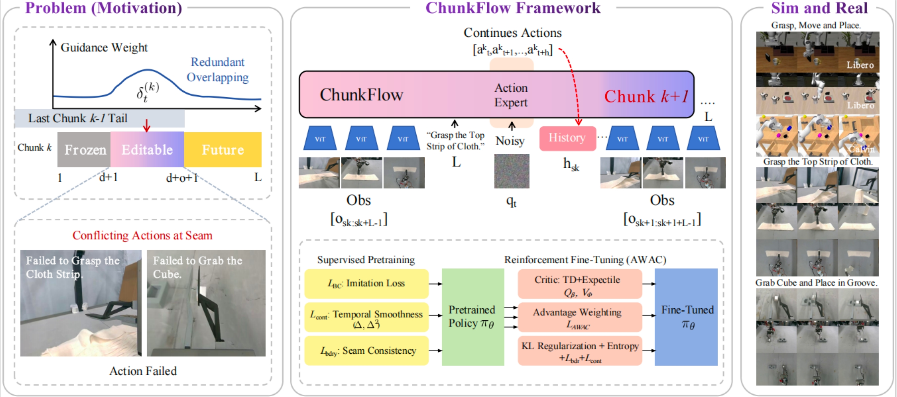
    Preprint
  

  

    

      ChunkFlow: Towards Continuity-Consistent Chunked Policy Learning
    

    
Zhao Yang, Yinan Shi, et al.

    
<em>Under review, 2025.</em>

    

      VLA policy with chunked actions, overlap blending, and continuity-constrained RL to suppress boundary jitter in long-horizon control.
    

    

      [<a href="#">PDF</a>] [<a href="#">Code</a>] [<a href="#">Project</a>]
    

  

<!-- DriVerse -->

  

    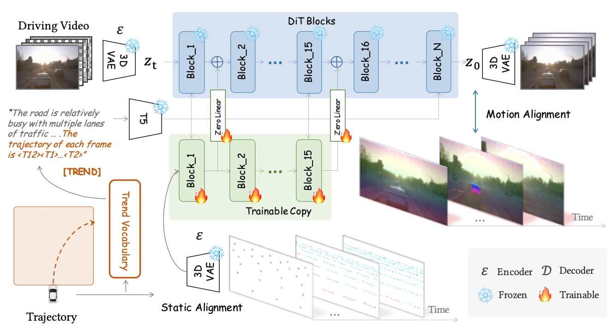
    ACM MM 2025
  

  

    

      DriVerse: Navigation World Model for Driving Simulation via Multimodal Trajectory Prompting and Motion Alignment
    

    
Xiaofan Li, Chenming Wu, Zhao Yang*, et al.

    
<em>ACM Multimedia (ACM MM), 2025.</em>

    

      A navigation-centric world model that conditions on multimodal trajectory prompts and enforces motion-aligned latent dynamics for driving simulation.
    

    

      [<a href="#">PDF</a>] [<a href="#">Code</a>] [<a href="#">Project</a>]
    

  

<!-- U-ViLAR -->

  

    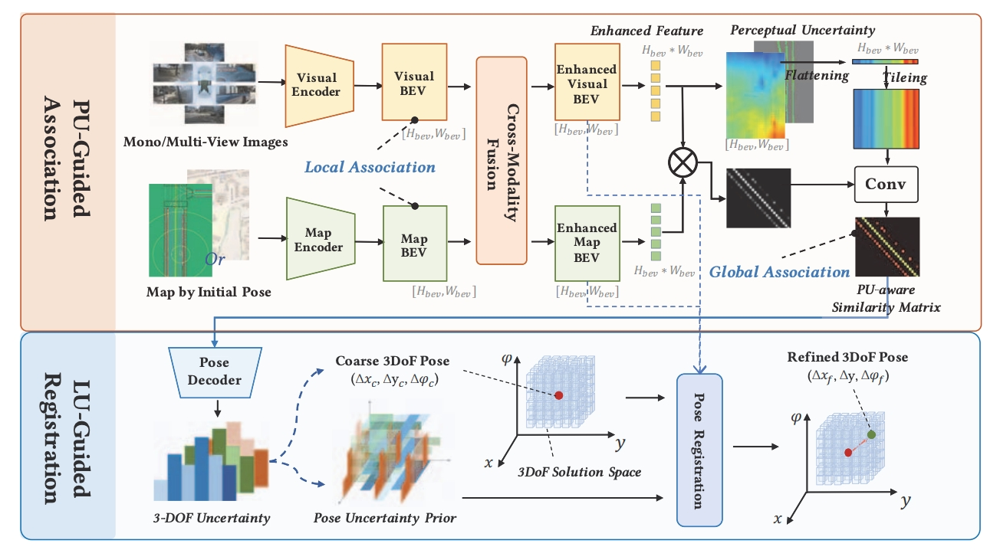
    ICCV 2025
  

  

    

      U-ViLAR: Uncertainty-Aware Visual Localization for Autonomous Driving via Differentiable Association and Registration
    

    
Xiaofan Li, Zhihao Xu, Chenming Wu, Zhao Yang, et al.

    
<em>IEEE/CVF International Conference on Computer Vision (ICCV), 2025.</em>

    

      Differentiable association and registration with explicit uncertainty modeling for robust large-scale localization in autonomous driving.
    

    

      [<a href="#">PDF</a>] [<a href="#">Code</a>]
    

  

<!-- Causal-Planner -->

  

    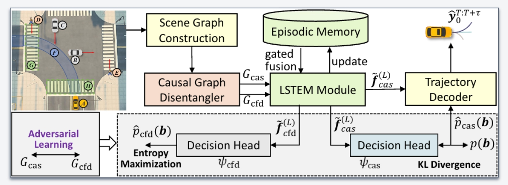
    IROS 2025
  

  

    

      Causal-Planner: Causal Interaction Disentangling with Episodic Memory Gating for Autonomous Planning
    

    
Yibo Yuan, Jianwu Fang, Yang Zhou, Zhao Yang, et al.

    
<em>IEEE/RSJ International Conference on Intelligent Robots and Systems (IROS), 2025.</em>

    

      Causal interaction modeling and memory-gated policy for interpretable planning in dynamic driving environments.
    

    

      [<a href="#">PDF</a>] [<a href="#">Code</a>]
    

  

<!-- Semi-supervised BEV 3D detection -->

  

    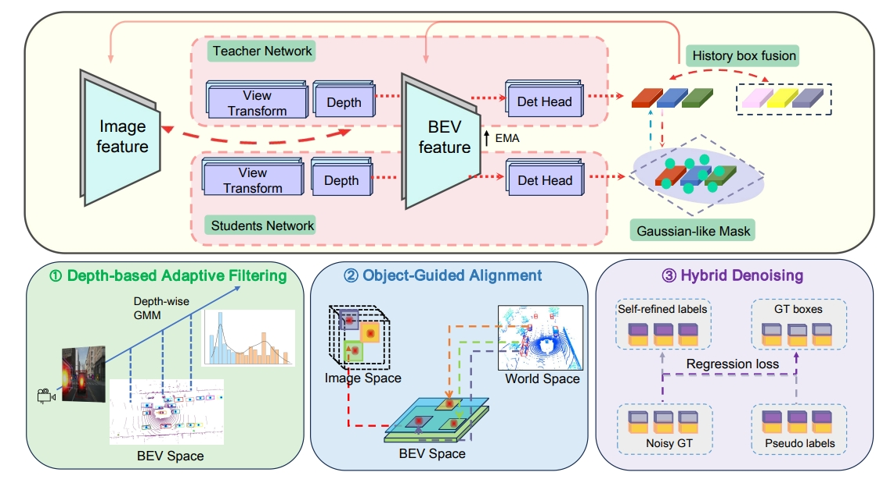
    ICRA 2025
  

  

    

      Towards Accurate Semi-Supervised BEV 3D Object Detection with Depth-Aware Refinement and Denoising-Aided Alignment
    

    
Zhao Yang, Yinan Shi, et al.

    
<em>IEEE International Conference on Robotics and Automation (ICRA), 2025.</em>

    

      Semi-supervised BEV detector with depth-aware refinement, denoising-aided alignment, and robust pseudo-labeling on nuScenes.
    

    

      [<a href="#">PDF</a>] [<a href="#">Code</a>]
    

  

<!-- DualDiff+ (Under review) -->

  

    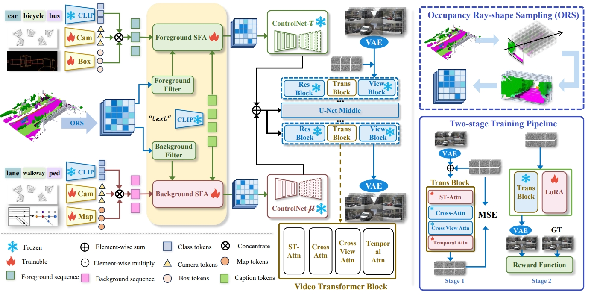
    Under Review
  

  

    

      DualDiff+: Dual-branch Diffusion for High-fidelity Video Generation with Reward Guidance
    

    
Zhao Yang, Zezhong Qian, et al.

    
<em>Under review, 2025.</em>

    

      Dual-branch diffusion with semantic and motion reward alignment for high-resolution, temporally coherent video synthesis.
    

    

      [<a href="#">PDF</a>] [<a href="#">Code</a>] [<a href="#">Project</a>]
    

  

<!-- DualDiff -->

  

    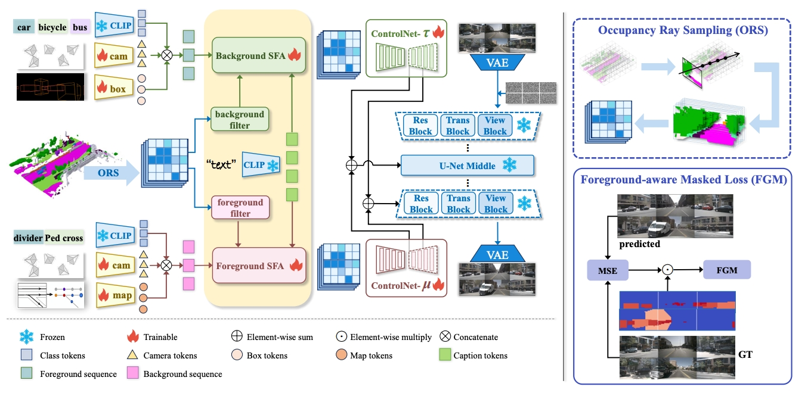
    ICRA 2025
  

  

    

      DualDiff: Dual-Branch Diffusion Model for Autonomous Driving with Semantic Fusion
    

    
Zhao Yang, Haoteng Li, et al.

    
<em>IEEE International Conference on Robotics and Automation (ICRA), 2025.</em>

    

      Dual-branch diffusion model that fuses semantic BEV priors with image features for controllable driving video and occupancy generation.
    

    

      [<a href="#">PDF</a>] [<a href="#">Code</a>]
    

  

<!-- T-ITS BEV 3D detection -->

  

    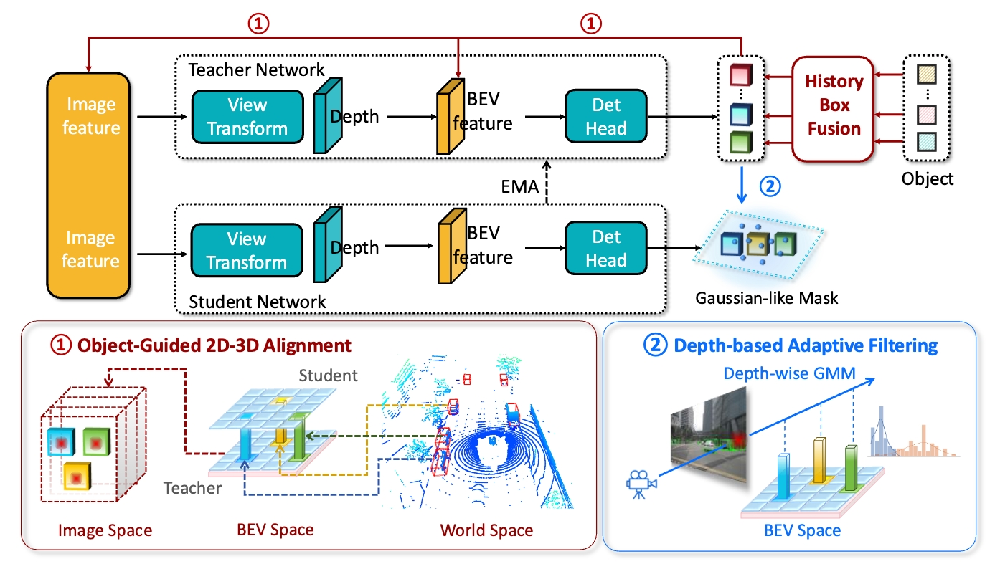
    T-ITS 2025
  

  

    

      Object-Guided Semi-Supervised Bird’s-Eye View 3D Object Detection with 3D Box Refinement
    

    
Zhao Yang, Yinan Shi, et al.

    
<em>IEEE Transactions on Intelligent Transportation Systems (T-ITS), 2025.</em>

    

      Semi-supervised BEV framework with object-guided consistency and box refinement, improving label efficiency on large-scale driving datasets.
    

    

      [<a href="#">PDF</a>] [<a href="#">Code</a>]
    

  

<!-- EquivFisheye -->

  

    
    Info Fusion (under review)
  

  

    

      EquivFisheye: A Spherical Fusion Framework for Panoramic 3D Perception with Surround-View Fisheye Cameras
    

    
Zhao Yang, Xinglin Pu, et al.

    
<em>Submitted to Information Fusion, 2025.</em>

    

      Spherical feature fusion and equivariant pooling for efficient panoramic 3D perception from multi-view fisheye cameras.
    

    

      [<a href="#">PDF</a>] [<a href="#">Code</a>]
    

  

<!-- Cadkp -->

  

    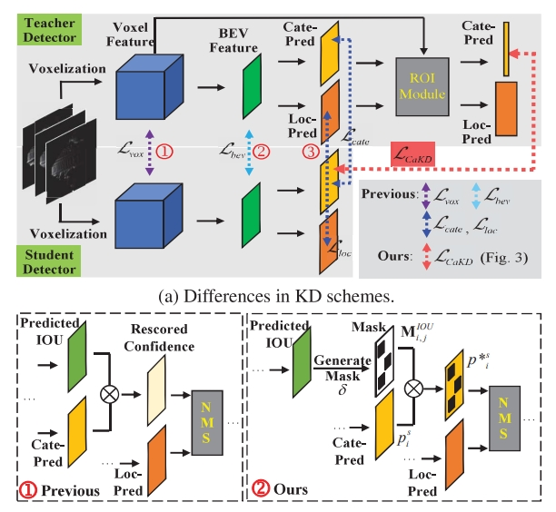
    CVPR 2024
  

  

    

      Cadkp: Category-aware Knowledge Distillation and Pruning Framework for Lightweight 3D Object Detection
    

    
Haonan Zhang, Longjun Liu, Yuqi Huang, Zhao Yang, et al.

    
<em>IEEE/CVF Conference on Computer Vision and Pattern Recognition (CVPR), 2024.</em>

    

      Category-aware distillation and structured pruning to obtain compact yet accurate 3D detectors for autonomous driving.
    

    

      [<a href="#">PDF</a>] [<a href="#">Code</a>]
    

  

<!-- RAG-Guided LLMs -->

  

    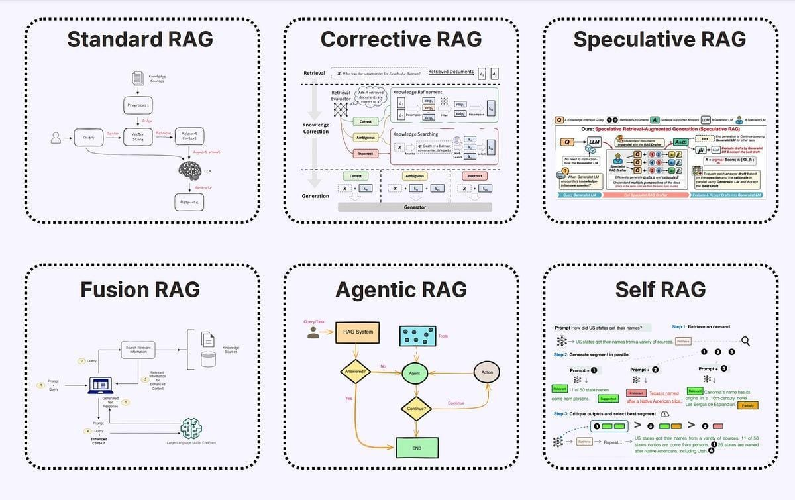
    ACM MM 2024
  

  

    

      RAG-Guided Large Language Models for Visual Spatial Description with Adaptive Hallucination Correction
    

    
Jun Yu, Yunxiang Zhang, Zerui Zhang, Zhao Yang et al.

    
<em>ACM Multimedia (ACM MM), 2024.</em>

    

      Retrieval-augmented LLMs for spatial description, with adaptive hallucination correction in vision-language reasoning.
    

    

      [<a href="#">PDF</a>] [<a href="#">Code</a>]
    

  

<!-- Temporal-Informative Adapters (ACM MM 2024) -->

  

    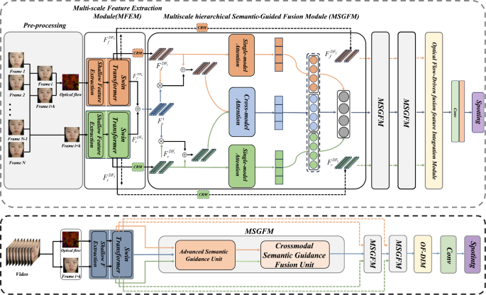
    ACM MM 2024
  

  

    

      Temporal-Informative Adapters in VideoMAE V2 and Multi-Scale Feature Fusion for Micro-Expression Spotting-then-Recognize
    

    
Jun Yu,Guopeng Zhao, Yaohui Zhang, Peng He, Zerui Zhang, Zhao Yang, et al.

    
<em>ACM Multimedia (ACM MM), 2024.</em>

    

      Temporal adapters and multi-scale fusion for fine-grained micro-expression analysis.
    

    

      [<a href="#">PDF</a>] [<a href="#">Code</a>]
    

  

<!-- IC-Mapper (ACM MM 2024) -->

  

    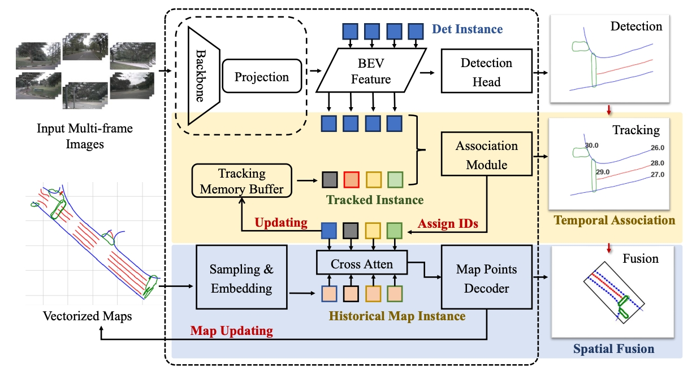
    ACM MM 2024
  

  

    

      IC-Mapper: Instance-Centric Spatio-Temporal Modeling for Online Vectorized Map Construction
    

    
Jiangtong Zhu*, Zhao Yang*, et al.

    
<em>ACM Multimedia (ACM MM), 2024.</em>

    

      Instance-centric spatio-temporal modeling for online HD map vectorization from autonomous driving logs.
    

    

      [<a href="#">PDF</a>] [<a href="#">Code</a>]
    

  

<!-- CVPR 2024 World Model Challenge -->

  

    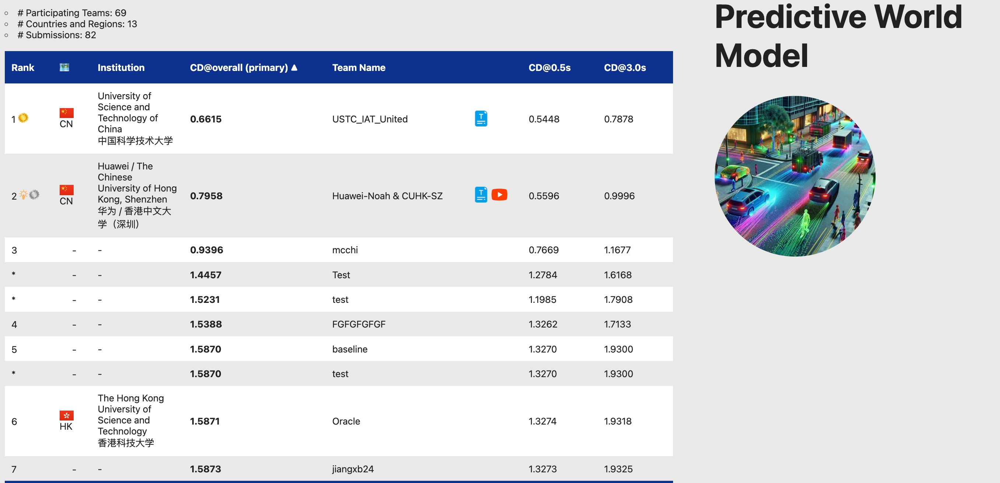
    CVPRW 2024 · 1st place
  

  

    

      The 1st-Place Solution for CVPR 2024 Autonomous Driving Grand Challenge Track on Predictive World Model
    

    
Z. Yang et al.

    
<em>CVPR 2024 Workshop on Autonomous Driving, 2024.</em>

    

      Large-scale world-model solution for multi-step predictive planning in autonomous driving, achieving 1st place in the CVPR 2024 challenge.
    

    

      [<a href="#">PDF</a>] [<a href="#">Code</a>]
    

  

 <!-- end recent works -->

### Earlier works

<!-- Malware GAN -->

  

    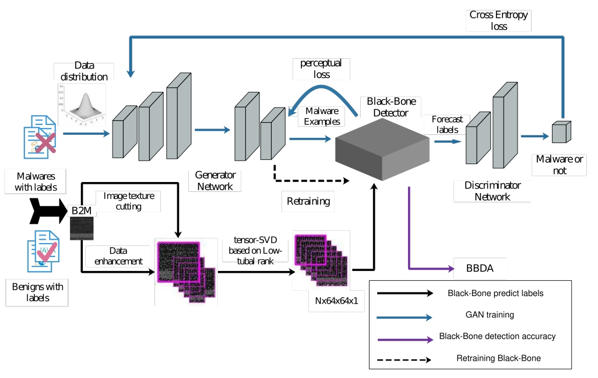
    Journal 2022
  

  

    

      Flexible Android Malware Detection Model Based on Generative Adversarial Networks with Code Tensor
    

    
Zhao Yang, Fengyang Deng, et al.

    
<em>IEEE Transactions on Cyber-Enabled Distributed Computing and Systems, 2022.</em>

    

      GAN-based code-tensor modeling for robust Android malware detection.
    

  

<!-- Mean-teacher SSD -->
<!-- 

  

    
    CVPR 2021
  

  

    

      Interactive Self-Training with Mean Teachers for Semi-Supervised Object Detection
    

    
Z. Yang et al.

    
<em>IEEE/CVF Conference on Computer Vision and Pattern Recognition (CVPR), 2021.</em>

    

      Semi-supervised detector training with interactive self-training and mean-teacher consistency.
    

  

 -->

<!-- Secure tensor decomposition -->

  

    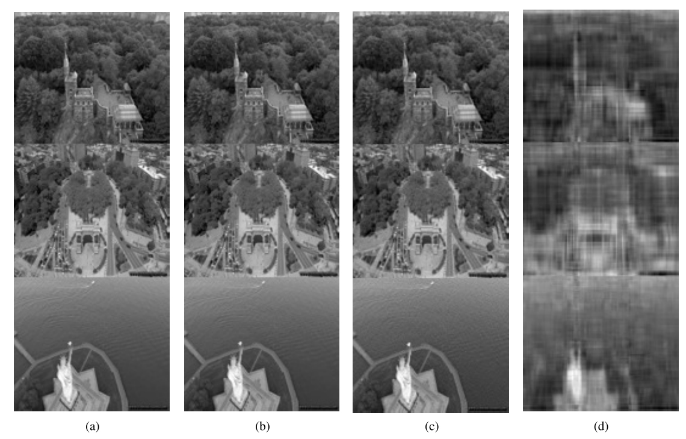
    T-CSS 2020
  

  

    

      Secure Tensor Decomposition for Heterogeneous Multimedia Data in Cloud Computing
    

    
Zhao Yang, Cai Fu, et al.

    
<em>IEEE Transactions on Computational Social Systems, 2020.</em>

    

      Privacy-preserving tensor decomposition framework for heterogeneous multimedia data in cloud environments.
    

  

<!-- WebVision 2020 -->

  

    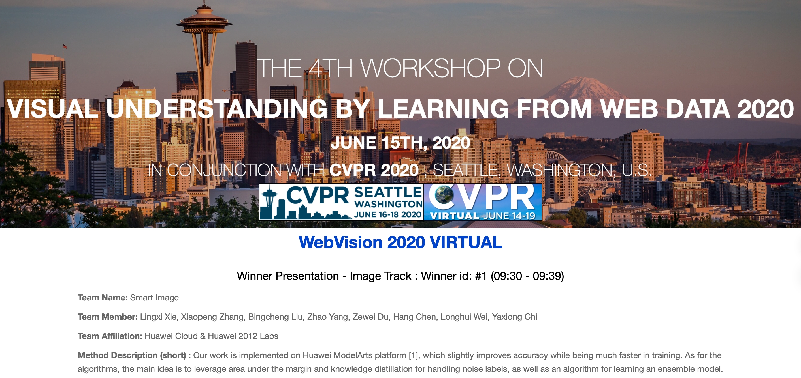
    CVPRW 2020 · 1st place
  

  

    

      The 1st-Place Solution for WebVision CVPR 2020 Virtual
    

    
Zhao Yang et al.

    
<em>CVPR 2020 WebVision Challenge Workshop.</em>

    

      Large-scale web-vision model with robust training on noisy labels, achieving 1st place in the WebVision 2020 challenge.
    

  

 <!-- end earlier works -->

---

## Service & Misc.

- Reviewer for major conferences and journals in vision and robotics (CVPR, ICCV, ECCV, ACM MM, ICRA, IROS, T-ITS, etc.).  
- Extensive experience with large-scale GPU clusters (A800 / A100), distributed training, and real autonomous driving platforms.  

If you are interested in collaborations on **world models**, **VLA agents**, or **diffusion-based planning**, feel free to contact me by email.
